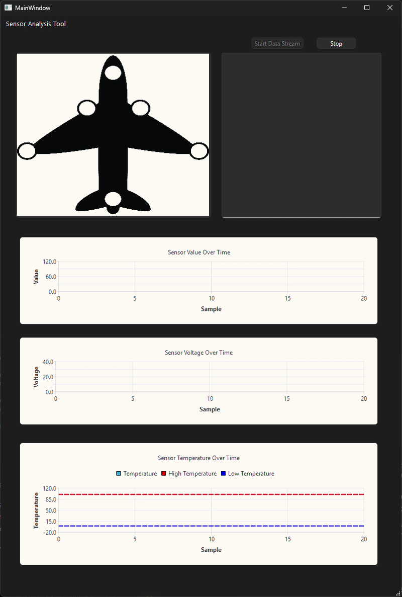

# Aircraft Sensor Monitor

A C++ and Qt desktop application that simulates monitoring sensor data from different locations on an aircraft.

I started this project as a way to improve my C++ and Qt skills while working on something related to real-time data monitoring and engineering software. The program currently reads simulated sensor data from a CSV file one record at a time and updates the interface as if the data were being received from a live system.

The sensor data used in this project is completely simulated and is not based on any real aircraft or avionics system.

## Example GIF



## Current Features

- Reads sensor data from a CSV file
- Processes one sensor reading per second using `QTimer`
- Displays a running history of sensor readings
- Supports Start, Stop, and Continue controls
- Displays a top-down aircraft image using `QGraphicsScene`
- Highlights the location of the sensor currently reporting data
- Changes the sensor marker color based on temperature
  - Green: normal temperature
  - Red: temperature above 100
  - Blue: temperature below 0
- Displays a live graph of sensor values
- Displays a live graph of sensor voltage
- Displays a live temperature graph
- Shows high and low temperature threshold lines
- Automatically scrolls the graphs to show the most recent samples
- Resets the simulated data stream after reaching the end of the CSV file

## Example Sensor Data

The application currently reads data in the following format:

```csv
sensor_name,value,temp,voltage,has_weapons
NOSE_RADAR,54.2,43.5,27.8,false
LEFT_WING,31.7,-4.2,28.1,true
ENGINE_LEFT,68.5,107.3,27.9,false
```

Each row represents one sensor reading.

The current simulated sensor locations include:

```text
NOSE_RADAR
LEFT_WING
RIGHT_WING
ENGINE_LEFT
ENGINE_RIGHT
TAIL_SENSOR
```

## How It Works

The CSV file acts as the simulated data source.

A Qt `QTimer` fires once every second. Each timer event reads one row from the CSV file and sends that data to the different parts of the interface.

```text
CSV File
    |
    v
QTimer
    |
    v
Read Sensor Record
    |
    +--------> Sensor Data Display
    |
    +--------> Aircraft Sensor Marker
    |
    +--------> Temperature Status
    |
    +--------> Value Graph
    |
    +--------> Voltage Graph
    |
    +--------> Temperature Graph
```

The aircraft marker and graphs are therefore all updated from the same sensor reading.

## Temperature Monitoring

The aircraft display uses color to show the temperature state of the current sensor.

```text
Temperature < 0       -> Blue
Temperature 0 - 100   -> Green
Temperature > 100     -> Red
```

The temperature graph also contains threshold lines at 0 and 100 so that abnormal temperatures are easier to see.

## Project Structure

The application is currently split between the GUI logic and sensor data processing.

```text
mainwindow.cpp / mainwindow.h
    Qt interface
    timers
    buttons
    aircraft visualization
    charts
    sensor highlighting

sensorData.cpp / sensorData.h
    CSV parsing
    sensor name extraction
    value extraction
    temperature extraction
    voltage extraction
    formatted sensor output

data/
    simulated CSV sensor data

images/
    aircraft image used by the interface
```

## Technologies Used

```text
C++
Qt 6
Qt Widgets
Qt Charts
QGraphicsScene / QGraphicsView
CMake
CSV data
Git / GitHub
```

## Running the Project

The project is currently being developed with Qt 6 and CMake.

Qt needs to include the Widgets and Charts modules.

Example CMake dependencies:

```cmake
find_package(Qt6 REQUIRED COMPONENTS Widgets Charts)
```

and:

```cmake
target_link_libraries(project_name PRIVATE
    Qt6::Widgets
    Qt6::Charts
)
```

The simulated sensor CSV file also needs to be available at the path expected by the application.

Currently:

```text
data/sensor_data_100_rows.csv
```

## What I Have Learned

This project has given me practice with several areas of C++ and Qt that I wanted to improve, especially event-driven programming.

Some of the main concepts I have worked with include file streams, CSV parsing, Qt signals and slots, timers, graphical scenes, dynamic chart updates, GUI state management, CMake configuration, and debugging compile/linker issues.

One of the more useful parts of the project has been learning how to keep different pieces of the interface synchronized around the same incoming sensor record.

## Future Improvements

There are several features I would like to add as I continue working on the project.

Possible next steps include separating sensor readings into a dedicated `SensorReading` structure, improving error handling for malformed input data, tracking individual sensors separately on the graphs, adding additional warning conditions, improving the overall UI layout, adding timestamps, supporting a larger or continuous data source, and eventually separating data acquisition from the GUI so the application could handle asynchronous input more cleanly.

## Project Purpose

This is a learning project focused on C++, Qt, GUI development, data visualization, and simulated sensor monitoring.

It is not intended to model or reproduce any real aircraft avionics system.
